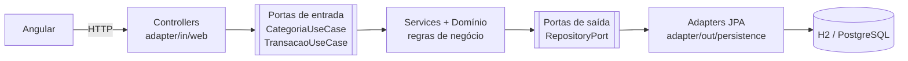

# Numo Web

Controle financeiro pessoal: categorias, receitas, despesas e saldo.

É a versão web do [Numo](https://numo-app-three.vercel.app), app que fiz em React Native + Supabase. Aqui a ideia foi reconstruir o mesmo produto com **Java (Spring Boot) no back-end usando Arquitetura Hexagonal** e **Angular no front-end**.

## Stack

| Camada | Tecnologia |
| --- | --- |
| Back-end | Java 21, Spring Boot, Spring Data JPA, Bean Validation |
| Banco | H2 em memória (trocável por PostgreSQL sem mexer no domínio) |
| Front-end | Angular 21, standalone components, signals, reactive forms |
| Testes | JUnit 5 |

## Arquitetura hexagonal

O núcleo (domínio + casos de uso) não conhece Spring, JPA nem HTTP. Ele define **portas** (interfaces) e o mundo externo se conecta por **adapters**.



```
backend/src/main/java/com/pedrosobreira/numo
├── domain/            # Categoria, Transacao, ResumoFinanceiro + regras (zero framework)
├── application/
│   ├── port/in/       # casos de uso que o mundo externo pode chamar
│   ├── port/out/      # o que o núcleo precisa do mundo externo
│   └── service/       # implementação dos casos de uso (sem @Service)
├── adapter/
│   ├── in/web/        # controllers REST, DTOs, tratamento de erros
│   └── out/persistence/ # entidades JPA e implementação das portas de saída
└── config/            # único lugar que liga o núcleo ao Spring
```

Na prática isso significa:

- **Regras no domínio**: valor precisa ser positivo, e uma categoria de despesa não aceita receita. Isso é validado na entidade `Transacao`, não no controller nem no banco.
- **Testes sem infraestrutura**: `TransacaoServiceTest` roda o caso de uso com repositórios em memória, sem subir Spring nem banco.
- **Troca de peças isolada**: mudar de H2 para PostgreSQL ou expor via GraphQL mexe só em um adapter.

## Rodando localmente

Pré-requisitos: JDK 21 e Node 20.19+ (ou 22+).

```bash
# back-end (porta 8080)
cd backend
./mvnw spring-boot:run

# front-end (porta 4200), em outro terminal
cd frontend
npm install
npm start
```

Abra http://localhost:4200. O Angular usa proxy para `/api`, então não precisa configurar URL.

Testes do back-end:

```bash
cd backend
./mvnw test
```

## API

| Método | Rota | Descrição |
| --- | --- | --- |
| GET | `/api/categorias` | Lista categorias |
| POST | `/api/categorias` | Cria categoria `{ nome, tipo }` |
| GET | `/api/transacoes` | Lista transações (mais recentes primeiro) |
| POST | `/api/transacoes` | Registra `{ descricao, valor, tipo, data, categoriaId }` |
| DELETE | `/api/transacoes/{id}` | Remove transação |
| GET | `/api/transacoes/resumo` | Total de receitas, despesas e saldo |

Erros seguem o padrão `ProblemDetail` (RFC 9457): 400 para validação, 404 para recurso inexistente, 422 para regra de negócio.

## Próximos passos

- [ ] PostgreSQL com Docker Compose
- [ ] Filtro por mês e por categoria
- [ ] Edição de transações
- [ ] Deploy (API + front)
